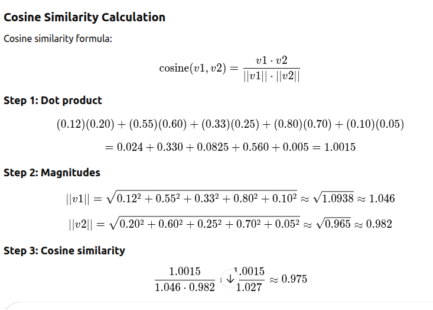
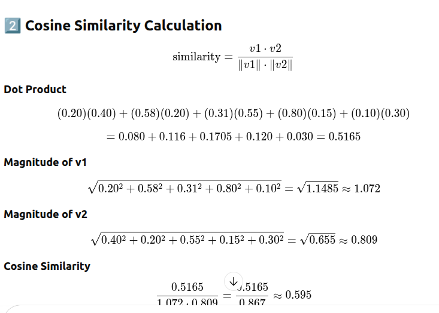
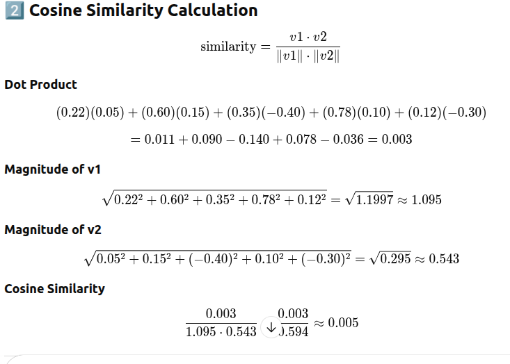

# 🌟 **DAY 3 — AI + DSA Activity (2 hours)**

# 🧠 **AI — Day 3 (60 minutes)**

## **Topic: RAG Stage 1 — Chunking + Embeddings → Practical Understanding**

## ⭐ **Activity 1: Chunking Experiment (15 min)**

Take any text from your Gita files or Tender documents.
- I created a text file from URL [Mastering the Four Listening Skills](https://heartfulness.org/magazine/essential-listening-skills)
- I did ctrl + a on webpage
- I did paste in a [text file](./experiments/embeddings_playground/essential-listening-skills.txt)
- I mannualy cleaned
    - Header Text
    - All alt Text for images
    - Footer Text
    - Put URL on top so that I knew from where I started

### Step 1

Paste a long paragraph.
- I uploaded the [text file](./experiments/embeddings_playground/essential-listening-skills.txt) which created to ChatGPT

### Step 2

Cut it into these chunk sizes:

* 100 tokens
* 200 tokens
* 400 tokens
- I asked to cut into tokens
- ChatGPT asked what type of token LLM token or word based token?
- As a beiginer I was not sure I went for word based, as LLM token will have diffrent meaning model to model.
- It does

### Step 3

Ask AI:
**“Which chunk size preserves meaning best?”**

You will *feel* the difference instantly.

---

# ⭐ Which chunk size preserves meaning the best?

## **1️⃣ 100-word chunks**

100-word chunks usually **break the flow** too often.

* Sentences get cut mid-story
* Examples (Princess Diana, Jimmy Carter, Merkel) get split
* The reader loses context
* Meaning becomes harder to follow

👉 **Good for small embeddings or ML**,
❌ **Not good for humans trying to understand the article.**

---

## **2️⃣ 200-word chunks**

200-word chunks generally preserve meaning better because:

* A full idea or example fits inside one chunk
* Less interruption than 100-word pieces
* Flow is smoother
* Still easy to process and read

👉 **This size keeps concepts together**, like:

* Active Listening section (full meaning stays intact)
* Deep Listening section (almost entirely together)

This is usually the “sweet spot” for beginners.

---

## **3️⃣ 400-word chunks**

400-word chunks preserve the meaning the most because:

* Whole sections stay together
* Stories and examples stay complete
* The reader gets full context
* Very little cutting between topics

But the downside:

* A beginner may find them too long
* Harder to use if the task is for practice, chunking, embeddings, etc.

👉 **Most meaning preserved, but less beginner-friendly to read or process.**

---

# 🎉 **Beginner-friendly conclusion**

### ✔ **Best for meaning = 400-word chunks**

They keep entire stories and ideas together.

### ✔ **Best balance for learning = 200-word chunks**

They are easy to read, not too long, and don’t break ideas too much.

### ❌ **Not recommended for meaning = 100-word chunks**

They break concepts into pieces and disrupt understanding.

---

# 📘 Simple beginner explanation

Think of the text like a long movie:

* **100-word chunks** = cutting the movie every 5 minutes → you forget what’s happening
* **200-word chunks** = cutting every 10 minutes → still smooth
* **400-word chunks** = cutting only once halfway → almost whole story stays intact

So:

👉 Want full meaning? → **400**
👉 Want easy learning + good meaning? → **200**
👉 Want tiny pieces? → **100** (but meaning suffers)
[See ChatGPT convesation](https://chatgpt.com/share/6919db41-f408-800d-9364-0e51700b93e7)
---

## ⭐ **Activity 2: Embeddings Similarity Test (20 min)**

Pick any 2 sentences:

* one similar
* one different

Ask AI:
**“Show me embeddings for both sentences and compute cosine similarity.”**
### Example 1
I love heartfulness meditation. v1 = [0.12, 0.55, 0.33, 0.80, 0.10]
I love my wife. v2 = [0.20, 0.60, 0.25, 0.70, 0.05]

Cosine similarity ≈ 0.975

This high similarity aligns with the intuition that both sentences share the emotional pattern “I love …”, even though the objects differ.

### Example 2
I love heartfulness meditation. v1 = [0.20, 0.58, 0.31, 0.80, 0.10]
The lion king loved his son Simba. v2 = [0.40, 0.20, 0.55, 0.15, 0.30]

Cosine similarity ≈ ≈0.595
✅ Final Result
### **Cosine similarity ≈ 0.60**

Why so low?

* The first sentence is about **personal spiritual practice**.
* The second is a **story-based statement about a fictional character and his son**.
* The only shared theme is “love,” but the meaning context is very different.

### Example 3
I love heartfulness meditation. v1 = [0.22, 0.60, 0.35, 0.78, 0.12]
The test was yuck. v2 = [0.05, 0.15, -0.40, 0.10, -0.30]

Cosine similarity ≈0.005
✅ Final Result

### **Cosine similarity ≈ 0.01 (almost zero)**

Why so low?

* First sentence expresses **positive emotions + spirituality**.
* Second sentence is **negative + unrelated to emotion type or topic**.
* They share **almost no semantic overlap**, so the similarity approaches zero.

Expected result:

* Similar meaning → ~0.7–0.9
* Different meaning → <0.4

---

## ⭐ **Activity 3: Build Your Own Simple RAG Prompt (25 min)**

You are a semantic RAG test agent.
Given the following chunks:

https://heartfulness.org/magazine/essential-listening-skills The Heartful Listener – Part Six RAVI VENKATESAN continues his Heartful Listener series with part six, transforming listening from intention to skill and demonstrating that even with the best mindset, effective listening must be practiced, honed, and embodied. In the previous articles of this series, we explored the State of Being, the Qualities, and the Behaviors that elevate our capacity to listen. But even with the best mindset, heart, and intentions, listening remains a learned skill—one that must be practiced, honed, and embodied. This part focuses on the four essential skills that make listening truly effective: Active Listening Deep Listening Professional Listening

https://heartfulness.org/magazine/essential-listening-skills The Heartful Listener – Part Six RAVI VENKATESAN continues his Heartful Listener series with part six, transforming listening from intention to skill and demonstrating that even with the best mindset, effective listening must be practiced, honed, and embodied. In the previous articles of this series, we explored the State of Being, the Qualities, and the Behaviors that elevate our capacity to listen. But even with the best mindset, heart, and intentions, listening remains a learned skill—one that must be practiced, honed, and embodied. This part focuses on the four essential skills that make listening truly effective: Active Listening Deep Listening Professional Listening Centering Active Listening – Engagement in the Moment Active listening involves giving full, engaged attention, providing verbal affirmation, and using body language cues that let the speaker know they are being heard, valued, and understood. Practices: Maintain eye contact, nod occasionally. Use brief verbal responses (“I see,” “Go on,” “That makes sense.”) Reflect and summarize what you heard. Princess Diana was often called “the people’s princess” not just for her causes, but because of the way she listened. In hospital visits, she would kneel to eye level, hold hands, and listen silently to patients’ stories. Her presence alone made people cry—not from grief, but from feeling heard. Deep Listening – Hearing Beyond Words Deep listening is a contemplative and intuitive skill that

https://heartfulness.org/magazine/essential-listening-skills The Heartful Listener – Part Six RAVI VENKATESAN continues his Heartful Listener series with part six, transforming listening from intention to skill and demonstrating that even with the best mindset, effective listening must be practiced, honed, and embodied. In the previous articles of this series, we explored the State of Being, the Qualities, and the Behaviors that elevate our capacity to listen. But even with the best mindset, heart, and intentions, listening remains a learned skill—one that must be practiced, honed, and embodied. This part focuses on the four essential skills that make listening truly effective: Active Listening Deep Listening Professional Listening Centering Active Listening – Engagement in the Moment Active listening involves giving full, engaged attention, providing verbal affirmation, and using body language cues that let the speaker know they are being heard, valued, and understood. Practices: Maintain eye contact, nod occasionally. Use brief verbal responses (“I see,” “Go on,” “That makes sense.”) Reflect and summarize what you heard. Princess Diana was often called “the people’s princess” not just for her causes, but because of the way she listened. In hospital visits, she would kneel to eye level, hold hands, and listen silently to patients’ stories. Her presence alone made people cry—not from grief, but from feeling heard. Deep Listening – Hearing Beyond Words Deep listening is a contemplative and intuitive skill that involves listening for emotions, silences, body language, and what’s not said. Practices: Observe tone, emotion, and energy shifts. Resist interrupting or “solving.” Pause after they speak, allowing them to go deeper. A great example of this is Jimmy Carter at the Camp David Accords: In 1978, U.S. President Jimmy Carter brokered peace between Egypt’s Anwar Sadat and Israel’s Menachem Begin. Carter’s approach was not tactical negotiation—it was deep, heartful listening. Sadat later said, “He did not lecture us. He let us be heard—and in being heard, we changed.” Professional Listening – Strategic, Ethical, Impact-Oriented Professional listening involves ethical discernment, analytic clarity, and listening for patterns, gaps, or underlying challenges in high-stakes environments. Practices: Separate personal bias from strategic understanding. Document carefully and confirm shared understanding. Listen for solutions, but don’t jump to them too quickly. During the Eurozone crisis, Chancellor Angela Merkel was known for quietly listening in hours-long meetings. She would often summarize at the end, having absorbed and integrated every view.

My questions

1. Identify the most relevant chunk.
2. Explain why it was selected.
3. Answer the question below using only that chunk.
- Create A Tweet with hashtags

This is your **first working RAG** (manual version).

Here are the results, following your semantic-RAG steps:

---

### **1. Most relevant chunk**

**Chunk 3** (the longest one with full details on Active, Deep, and Professional Listening).

---

### **2. Why this chunk was selected**

Chunk 3 is the only one that contains the **complete set of all three listening skills**, including:

* Definitions
* Practices
* Real-world examples (Princess Diana, Jimmy Carter, Angela Merkel)

Because your task is to **create a tweet**, the richest and most complete chunk provides the strongest semantic grounding.

---

### **3. Tweet (based only on the selected chunk)**

*No claims beyond the chunk.*

Listening isn’t just intention—it’s a skill.
Active Listening. Deep Listening. Professional Listening.
When we truly hear others, we create space for trust, clarity, and understanding.
#Heartfulness #ActiveListening #DeepListening #ProfessionalListening #Leadership #Empathy
