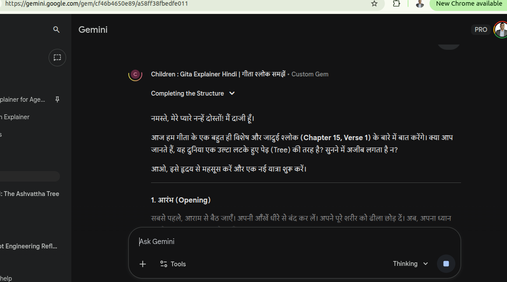
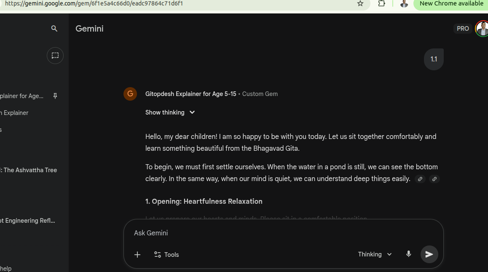
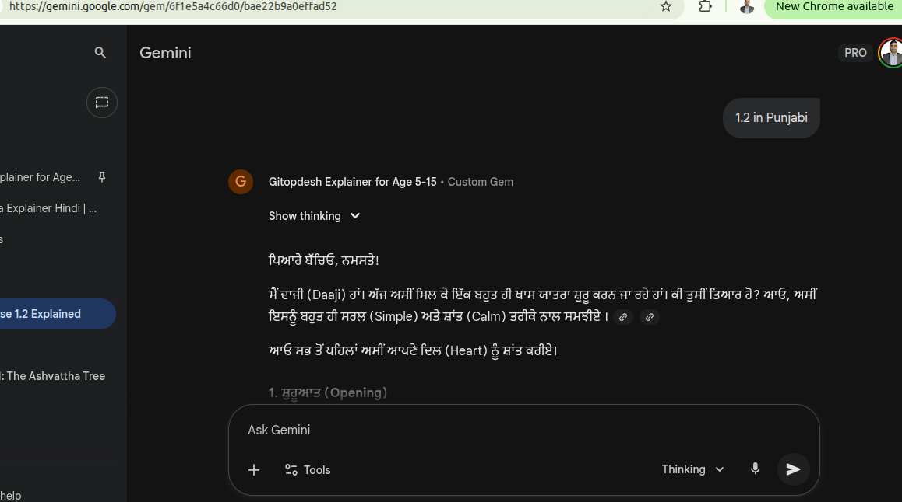
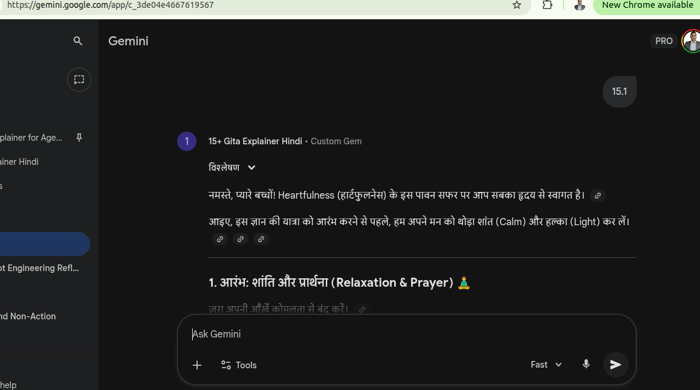
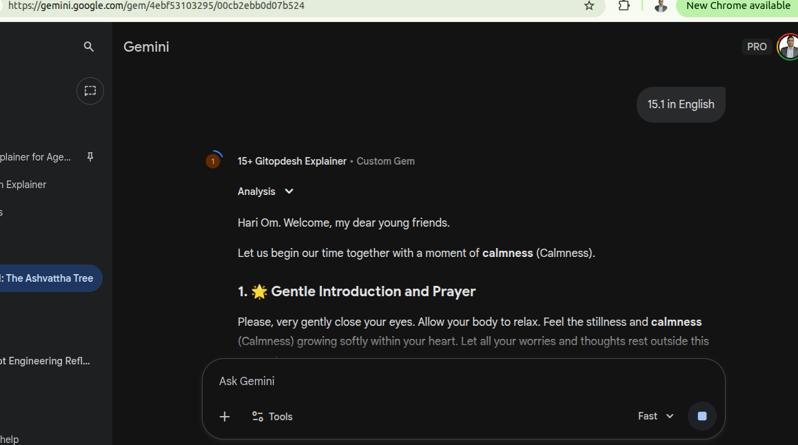
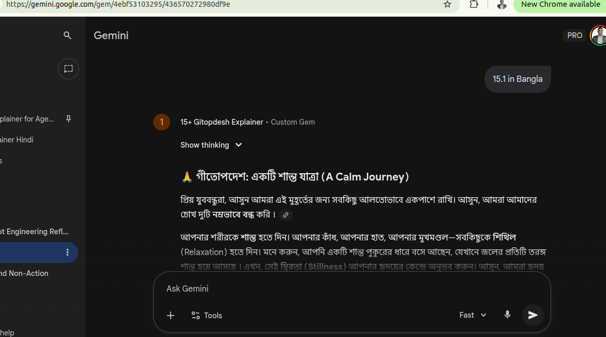

# Gitopdesh Chat Bot for Age 5–15
This is Google Gemini AI-powered Gitopdesh Chatbot (Custom Gems) teaching tools.

* [Hindi Version – 1st creation](https://gemini.google.com/gem/11iRAUOkuLceY105VaA0eyh7oYw-OsM0U?usp=sharing)
* [Multilingual – Latest version 3rd creation](https://gemini.google.com/gem/11iRAUOkuLceY105VaA0eyh7oYw-OsM0U?usp=sharing)

# Gitopdesh Chat Bot for Age 15+

* [Hindi Version – 2nd creation](https://gemini.google.com/gem/1igIq9Y83NBGwlcPREXn2AVN2O3Djhytg?usp=sharing)
* [Multilingual – Latest version 4th creation](https://gemini.google.com/gem/1RJOU2SSWIfbRHGEbB7BkBr1peSREvzkW?usp=sharing)

# Examples
## Age Group 5-15
- Hindi 
- English 
- Punjabi 

## Age Group 5-15
- Hindi 
- English 
- Bangla 

# Features 
- Hindi versions for different age groups
- Multilingual versions
- Daaji-style calm, heart-centered teaching
- Minimal hallucination, maximum authenticity
- "AI is like Krishna's chariot — you must hold the reins with clarity."

# Structure
Each Session will have below section
- Opening with Heartfulness Prayer Relaxation
- Ice-Breaker Activity
- Stories
- Full Sanskrit Verse
- Four-Pāda Table
- Meaning + Heartfulness Connection
- Word Meaning Table
- Reflection
- Sandhi–Viched
- INTERACTIVE MCQ QUIZ

